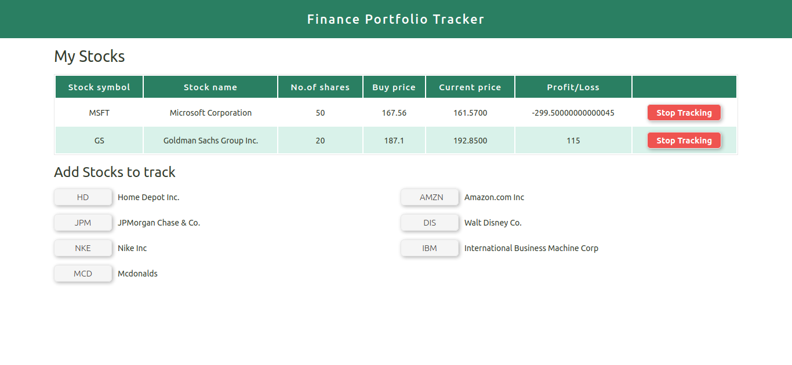

# Finance Portfolio Tracker

## Overview

A React WebAPP for tracking your financial portfolio, using the Alpha Advantage API and showing the profit and loss for a particular time of a day.
Using Firebase Firestore as a Database to store the user data for tracking the stocks they want.

[Live Preview](https://financial-portfolio-tracker.firebaseapp.com/)



## Built With

<ul>
<li> Create React APP </li>
<li> SASS </li>
<li> Firebase Firestore DB </li>
</ul>

## Development
--------------

Clone the repo and cd into the folder where the repo has been cloned, run ```npm install``` to install all the dependencies

### Usage

1. Get a free API Key at https://www.alphavantage.co
1. Create a ```.env``` file on the root folder

#### Sample ENV file

```env
REACT_APP_APIKEY=yourapikey
```

Once the dependencies are installed, you can run ```npm start``` to start the application.

App will be live at localhost:3000

## Author

👤 **Shubham Battoo**

* Twitter: [@Shubham_batt](https://twitter.com/Shubham_batt)
* Github: [@shubhambattoo](https://github.com/shubhambattoo)

## Show your support

Give a ⭐️ if this project helped you!
